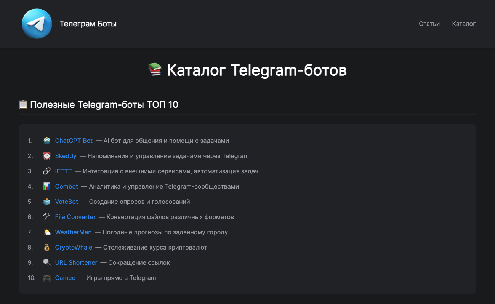

# Каталог Telegram-ботов

Веб-приложение для поиска и просмотра полезных Telegram-ботов. Каталог включает боты для различных целей: общение, утилиты, игры, бизнес и многое другое.

## 🚀 Функции

- Категоризированный список ботов
- Детальные описания и статистика
- Удобный поиск и фильтрация
- Статьи и руководства по использованию ботов
- Адаптивный дизайн для всех устройств

## 📂 Структура проекта

```text
/
├── public/
│   └── favicon.svg
├── src/
│   ├── assets/
│   │   ├── logo.svg
│   │   ├── astro.svg
│   │   └── background.svg
│   ├── components/
│   │   ├── BotCard.astro
│   │   ├── BotList.astro
│   │   ├── BotTable.astro
│   │   ├── Header.astro
│   │   └── Welcome.astro
│   ├── data/
│   │   ├── chatBots.json
│   │   ├── datingBots.json
│   │   ├── entertainmentBots.json
│   │   ├── gameBots.json
│   │   ├── healthBots.json
│   │   ├── languageBots.json
│   │   ├── mediaBots.json
│   │   ├── officialBots.json
│   │   ├── stickerBots.json
│   │   ├── usefulBots.json
│   │   └── utilityBots.json
│   ├── layouts/
│   │   └── Layout.astro
│   └── pages/
│       ├── articles/
│       │   ├── business-bots.astro
│       │   ├── how-to-create-telegram-bot.astro
│       │   └── top-10-admin-bots.astro
│       ├── articles.astro
│       ├── catalog.astro
│       └── index.astro
└── package.json
```

## 🛠️ Технологии

- [Astro](https://astro.build) - Современный фреймворк для создания веб-сайтов
- [@astrojs/image](https://docs.astro.build/en/guides/integrations-guide/image/) - Оптимизация изображений
- [Tailwind CSS](https://tailwindcss.com) - Утилитарный CSS-фреймворк
- [TypeScript](https://www.typescriptlang.org) - Типизированный JavaScript

## 🚦 Начало работы

1. Установка зависимостей:
```bash
npm install
```

2. Запуск сервера разработки:
```bash
npm run dev
```

3. Сборка для продакшена:
```bash
npm run build
```

4. Предпросмотр сборки:
```bash
npm run preview
```

## 📝 Команды

| Команда | Действие |
| :--- | :--- |
| `npm install` | Установка зависимостей |
| `npm run dev` | Запуск сервера разработки |
| `npm run build` | Сборка для продакшена |
| `npm run preview` | Предпросмотр сборки |
| `npm run astro ...` | Запуск CLI-команд Astro |

## 🤝 Вклад в проект

1. Форкните репозиторий
2. Создайте ветку для ваших изменений
3. Внесите изменения
4. Создайте Pull Request

## 📄 Лицензия

MIT License - используйте код как пожелаете